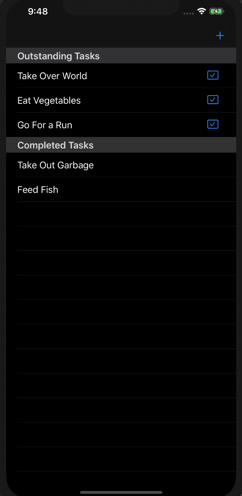
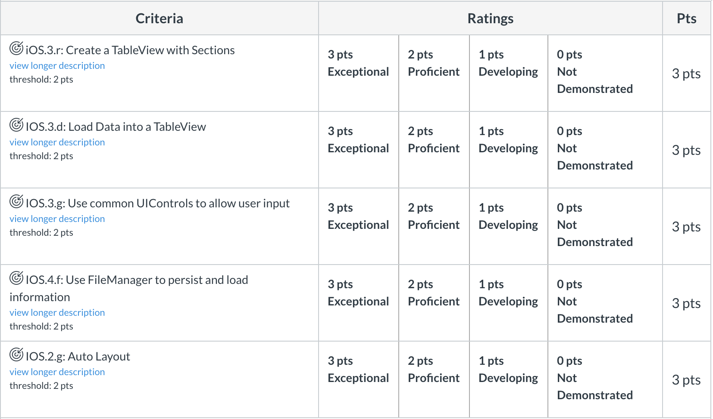

# Pursuit-Core-iOS-ToDos

## Overview 

Create a simple To-Do app

Create your own Repo! Submit on Canvas!

## Requirements 
- The app must be implemented as a native iOS application. Either Swift or Objective-C are acceptable.
- Use a table view with two sections: "Outstanding Tasks" and "Completed Tasks". Cells in both sections describe a task.
- The cells in the "Outstanding Tasks" section should have a button to allow you to complete a task. The cells in the "Completed Tasks" section should not have a button.
- Pressing the button on a cell in the "Outstanding Tasks" section should complete the task (moving it to the "Completed Tasks" section).
- Tasks in both sections should be persisted locally.
- The user should have the ability to create a new ToDo to the "Outstanding Tasks" section, whether by transitioning to a new screen or by adding an alert.

## What We Are Looking For

- Clean, well-architected, intuitively-named code.
- A simple User Interface that fits on multiple iPhone devices by using Autolayout.
- MVC Design.

## Sample UI

## Stretch
- Use animations.
- Use Core Data instead of PList persistence.
- Add a "due date" to each task when it is created, and change the color of the cell if it is overdue but still outstanding.
- Allow user to add the ToDo to their calendar, using proper permissions.

## Rubric

